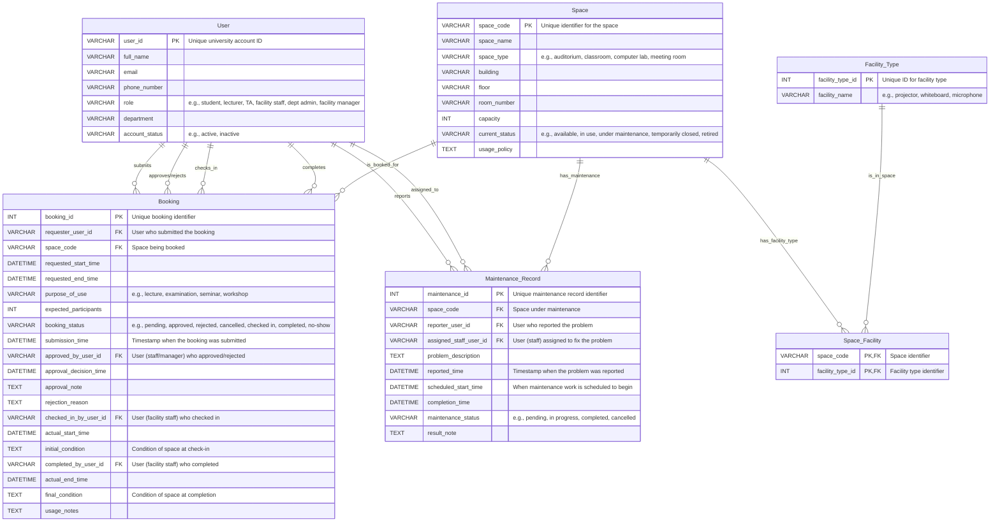

```mermaid
erDiagram
    User {
        VARCHAR user_id PK "Unique university account ID"
        VARCHAR full_name
        VARCHAR email
        VARCHAR phone_number
        VARCHAR role "e.g., student, lecturer, TA, facility staff, dept admin, facility manager"
        VARCHAR department
        VARCHAR account_status "e.g., active, inactive"
    }

    Space {
        VARCHAR space_code PK "Unique identifier for the space"
        VARCHAR space_name
        VARCHAR space_type "e.g., auditorium, classroom, computer lab, meeting room"
        VARCHAR building
        VARCHAR floor
        VARCHAR room_number
        INT capacity
        VARCHAR current_status "e.g., available, in use, under maintenance, temporarily closed, retired"
        TEXT usage_policy
    }

    Facility_Type {
        INT facility_type_id PK "Unique ID for facility type"
        VARCHAR facility_name "e.g., projector, whiteboard, microphone"
    }

    Booking {
        INT booking_id PK "Unique booking identifier"
        VARCHAR requester_user_id FK "User who submitted the booking"
        VARCHAR space_code FK "Space being booked"
        DATETIME requested_start_time
        DATETIME requested_end_time
        VARCHAR purpose_of_use "e.g., lecture, examination, seminar, workshop"
        INT expected_participants
        VARCHAR booking_status "e.g., pending, approved, rejected, cancelled, checked in, completed, no-show"
        DATETIME submission_time "Timestamp when the booking was submitted"

        VARCHAR approved_by_user_id FK "User (staff/manager) who approved/rejected"
        DATETIME approval_decision_time
        TEXT approval_note
        TEXT rejection_reason

        VARCHAR checked_in_by_user_id FK "User (facility staff) who checked in"
        DATETIME actual_start_time
        TEXT initial_condition "Condition of space at check-in"

        VARCHAR completed_by_user_id FK "User (facility staff) who completed"
        DATETIME actual_end_time
        TEXT final_condition "Condition of space at completion"
        TEXT usage_notes
    }

    Maintenance_Record {
        INT maintenance_id PK "Unique maintenance record identifier"
        VARCHAR space_code FK "Space under maintenance"
        VARCHAR reporter_user_id FK "User who reported the problem"
        VARCHAR assigned_staff_user_id FK "User (staff) assigned to fix the problem"
        TEXT problem_description
        DATETIME reported_time "Timestamp when the problem was reported"
        DATETIME scheduled_start_time "When maintenance work is scheduled to begin"
        DATETIME completion_time
        VARCHAR maintenance_status "e.g., pending, in progress, completed, cancelled"
        TEXT result_note
    }

    Space_Facility {
        VARCHAR space_code PK,FK "Space identifier"
        INT facility_type_id PK,FK "Facility type identifier"
    }

    User ||--o{ Booking : "submits"
    User ||--o{ Booking : "approves/rejects"
    User ||--o{ Booking : "checks_in"
    User ||--o{ Booking : "completes"
    User ||--o{ Maintenance_Record : "reports"
    User ||--o{ Maintenance_Record : "assigned_to"

    Space ||--o{ Booking : "is_booked_for"
    Space ||--o{ Maintenance_Record : "has_maintenance"
    Space ||--o{ Space_Facility : "has_facility_type"
    Facility_Type ||--o{ Space_Facility : "is_in_space"
```